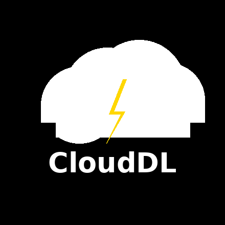

  

# Cloud-DL

A minimalist cloud downloader for Google Drive. Bypass ISP throttling and local storage limits with built-in torrent support, file previews, and selective downloading.

## Your Cloud, Your Speed

**CloudDL** is a high-performance cloud-based downloader designed to bypass local storage limitations and ISP throttling.

Paste any link—**direct downloads**, **magnets**, or **torrents**—and let our servers handle the heavy lifting, delivering files directly to your **Google Drive** at data-center speeds.

---

## 🚀 Key Features

| Feature | Description |
|---|---|
| **Data-Center Speeds** | Download files at the speed of Google’s backbone infrastructure. |
| **Zero Local Storage** | Save massive files directly to the cloud. Your phone/PC storage stays empty. |
| **Built-in Torrent Client** | Support for Magnet links and `.torrent` files with selective file downloading. |
| **Live Previews** | View thumbnails and file sizes before you commit to the download. |
| **Bandwidth Control** | Set custom speed limits to manage your cloud traffic. |

---

## 🛠️ How It Works

1. **Paste & Analyze**: Drop any download link or magnet into the dashboard.
2. **Preview & Select**: Check the file contents and set your preferred speed limits.
3. **Cloud Sync**: CloudDL fetches the data and syncs it instantly to your linked Google Drive.

> Stop waiting for hours on throttled connections. CloudDL moves your data where it belongs—instantly.

---

## 📱 Selective Downloading

Why download a **200GB** torrent when you only need one file? CloudDL allows you to:

- Browse the full file tree of any torrent
- Select only the specific `.mp4`, `.zip`, or `.iso` files you need
- Save credits and avoid downloading what you don’t want

---

## 💳 Pricing & Getting Started

We believe in our speed. That’s why we offer a **7-Day Free Trial** for all new users.

- **Trial**: Full access to all features for 7 days
- **Pro**: Unlimited speed, priority queue, and multi-device support

---

## 🤝 Contributing

Interested in making CloudDL even faster? Contributions are welcome—especially for API wrappers and UI components.

See `CONTRIBUTING.md` for guidelines.
